# Oh My Chat

A chat app assignment for Mobile Application Development course.

## Built with
This app is developed using:
* Android Studio: IDE used, code written in Java
* Firebase: Realtime Database

## Features
* Authentication
    * Create account
    * Sign in
    * Reset password by email

* Profile
    * Upload avatar
    * Change name and status
    * Change password
    
* Messaging
    * Chat with other users
    * Group chat
    
* Friends
    * Find friends
    * Accept Friend Requests
    
* Requests
    * Send or Cancel friend requests
    
* Lists
    * Current requests
    * Current group chat
    * List of messages

## Firebase Design

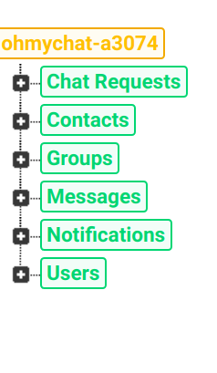

```json
{
  "Chat Requests" : {
    "cwdxrXpm39fYXT7QvzH6z1fGNbj1" : {
      "zPy69smXOwZS8CAgu48jVSX5kn52" : {
        "requestType" : "received"          
      }
    },
    "zPy69smXOwZS8CAgu48jVSX5kn52" : {     
      "cwdxrXpm39fYXT7QvzH6z1fGNbj1" : {
        "requestType" : "sent"            
      }
    }
  },
  "Contacts" : {                           
    "A2K92pVYdHbdDQZGBSARKy0mT8z1" : {    
      "cwdxrXpm39fYXT7QvzH6z1fGNbj1" : {
        "Contact" : "Saved"                 
      },                                    
      "px5mcnyvy8NeTh84yXcf1Xur5Dm2" : {    
        "Contact" : "Saved"                 
      }                                     
    },
    "cwdxrXpm39fYXT7QvzH6z1fGNbj1" : {
      "A2K92pVYdHbdDQZGBSARKy0mT8z1" : {
        "Contact" : "Saved"
      },
      "px5mcnyvy8NeTh84yXcf1Xur5Dm2" : {
        "Contact" : "Saved"
      }
    },
    "px5mcnyvy8NeTh84yXcf1Xur5Dm2" : {
      "A2K92pVYdHbdDQZGBSARKy0mT8z1" : {
        "Contact" : "Saved"
      },
      "cwdxrXpm39fYXT7QvzH6z1fGNbj1" : {
        "Contact" : "Saved"
      }
    }
  },
  "Groups" : {
    "Cùng nhau học Android" : {
      "-LerCwshHvxxrH003ZCv" : {
        "date" : "thg 5 14, 2019",
        "message" : "hello các cậu, sao k có notification ",
        "name" : "yêu em không lí do",
        "time" : "11:40 CH"
      },
      "-LerCy6mZRlM85YS9FfR" : {
        "date" : "May 14, 2019",
        "message" : "Hello pita, hello Mary!~~",
        "name" : "tung",
        "time" : "11:40 PM"
      }
    },
    "Oh My Chat Devs" : ""
  },
  "Messages" : {
    "A2K92pVYdHbdDQZGBSARKy0mT8z1" : {
      "cwdxrXpm39fYXT7QvzH6z1fGNbj1" : {
          "from" : "cwdxrXpm39fYXT7QvzH6z1fGNbj1",
          "message" : "Xin chào bạn Tùng 🤩🤩",
          "time" : "11:40 CH",
          "type" : "text"
        },
        "-LerD8IFeKuTJuX91MFy" : {
          "from" : "A2K92pVYdHbdDQZGBSARKy0mT8z1",
          "message" : "hello Ms Thoai ~~🥰🥰",
          "time" : "11:41 PM",
          "type" : "text"
        }
      }
    },
    "cwdxrXpm39fYXT7QvzH6z1fGNbj1" : {
      "A2K92pVYdHbdDQZGBSARKy0mT8z1" : {
        "-LerCzTervVvRaLTcOKQ" : {
          "from" : "cwdxrXpm39fYXT7QvzH6z1fGNbj1",
          "message" : "Xin chào bạn Tùng 🤩🤩",
          "time" : "11:40 CH",
          "type" : "text"
        },
        "-LerD8IFeKuTJuX91MFy" : {
          "from" : "A2K92pVYdHbdDQZGBARKy0mT8z1",
          "message" : "hello Ms Thoai ~~🥰🥰",
          "time" : "11:41 PM",
          "type" : "text"
        }
      }
    }
  },
  "Notifications" : {
    "A2K92pVYdHbdDQZGBSARKy0mT8z1" : {
      "-LerBvZTHDMxoGq9dffX" : {
        "from" : "px5mcnyvy8NeTh84yXcf1Xur5Dm2",
        "type" : "request"
      }
    }
  },
  "Users" : {
    "A2K92pVYdHbdDQZGBSARKy0mT8z1" : {
      "deviceToken" : "cWeU5iXzIJk:APA91bH929p62N3YXkmIfofqj_bmE-9gXe9sEcfvKUjrblSbLKAKUgPuOfbY16yxsIs5REYaiEFB1HSB6WI9VJfE0vA4h-Z7cb-VEnOVkh-boFaUGyj-jmsokMDPTjDkgw1TyGwDuL",
      "image" : "https://firebasestorage.googleapis.com/v0/b/ohmychat-a3074.appspot.com/o/Profile%20Images%2FA2K92pVYdHbdDQZGBSARKy0mT8z1.jpg?alt=media&token=8106da68-b467-4260-b009-5f04438997aa",
      "name" : "tung",
      "status" : "I love you,:3",
      "uid" : "A2K92pVYdHbdDQZGBSARy0mT8z1",
      "userState" : {
        "date" : "May 14, 2019",
        "state" : "online",
        "time" : "11:43 32"
      }
    },
    "cwdxrXpm39fYXT7QvzH6z1fGNbj1" : {
      "deviceToken" : "dueEbN-TbzM:APA91bE_Achf2rtfk7CbXPmkVu2vu3EqPHnmvefUw1IqBamssUKC-vUov5vZNCsuojrJcUOdw37YfzUzVpAJkvUaIc7L1FZkXm9wcJiavR_WAWW8cpCgjnoGZbO6GddCDLVlGpB3gh",
      "image" : "https://firebasestorage.googleapis.com/v0/b/ohmychat-a3074.appspot.com/o/Profile%20Images%2FcwdxrXpm39fYXT7QvzHNbj1.jpg?alt=media&token=5b762eb8-96f9-4000-8e72-280beaf30b29",
      "name" : "Thoại Nguyễn",
      "status" : "😍Yêu em từ ánh mắt ấy 😘",
      "uid" : "cwdxrXpm39fYXT7zH6z1fGNbj1",
      "userState" : {
        "date" : "thg 5 15, 2019",
        "state" : "offline",
        "time" : "01:30 40"
      }
    }
  }
}
```

## Screenshots

<p align="center">
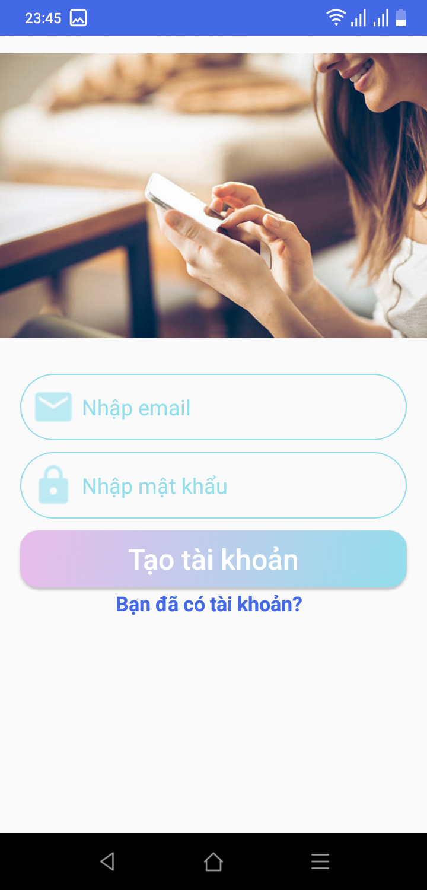
</p>

<p align="center">
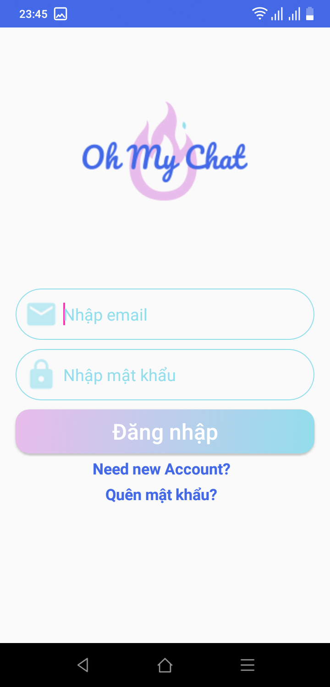
</po>

<p align="center">
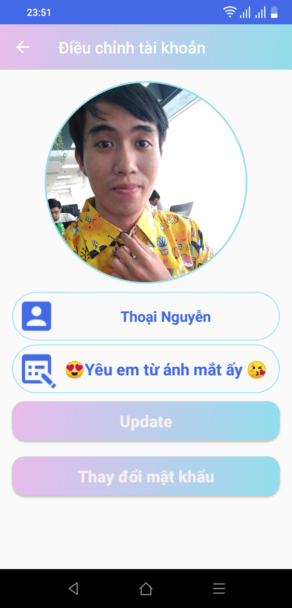
</p>

<p align="center">
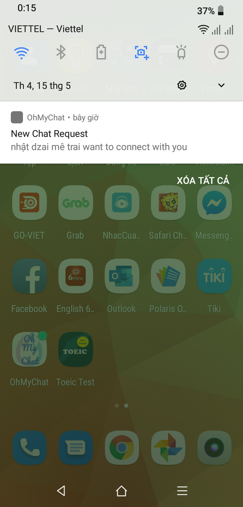
</p>

<p align="center">
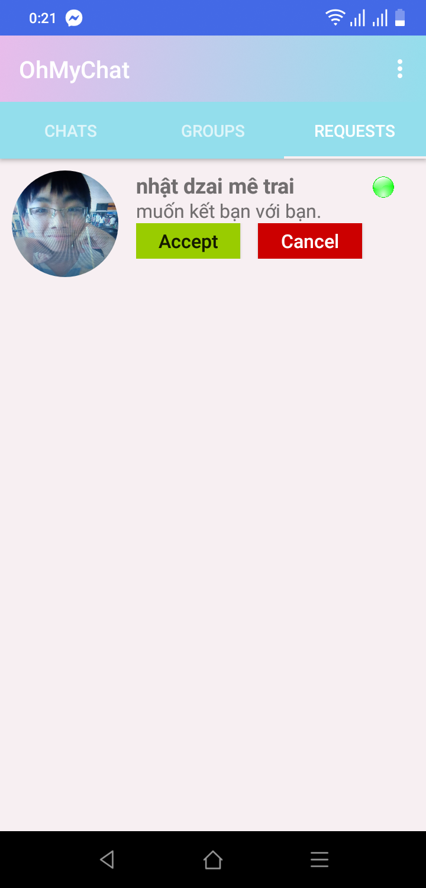
</p>

<p align="center">
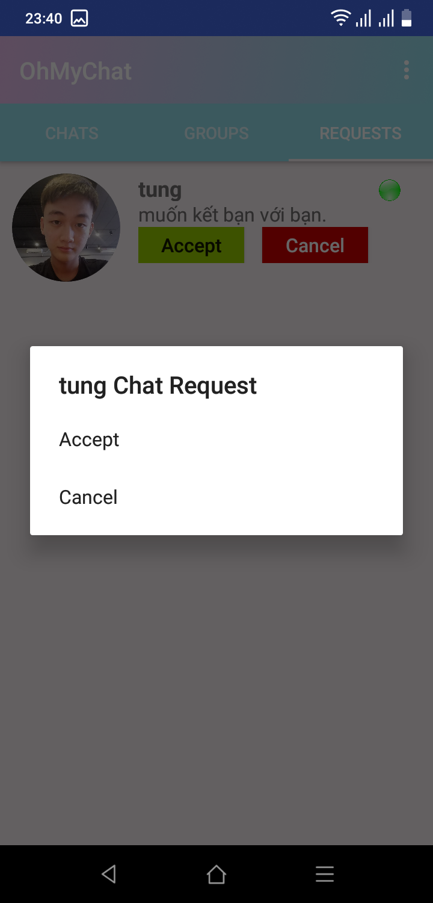
</p>

<p align="center">
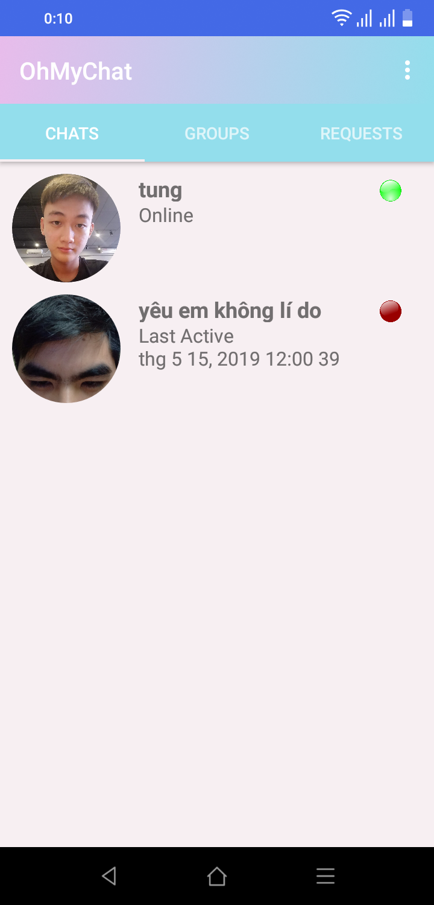
</p>

<p align="center">
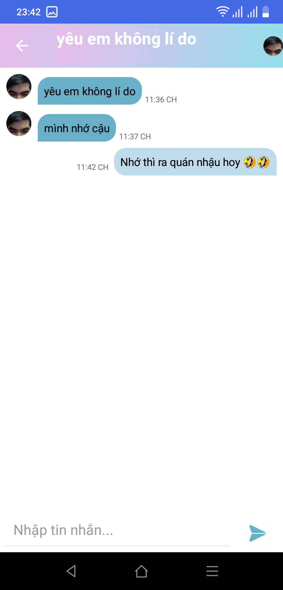
</p>

<p align="center">
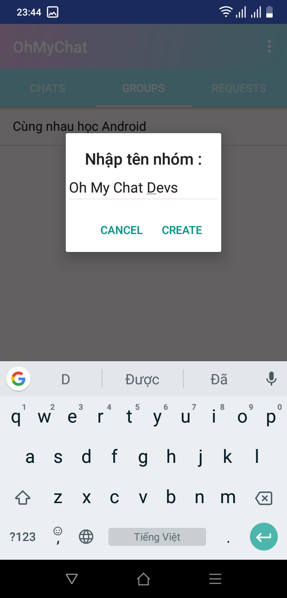
</p>

<p align="center">
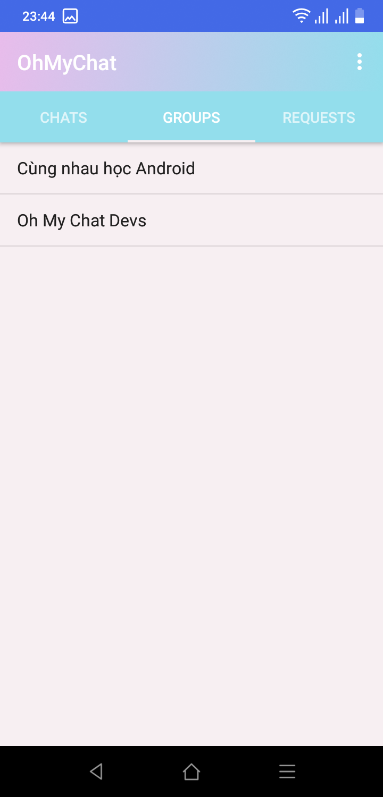
</p>

<p align="center">
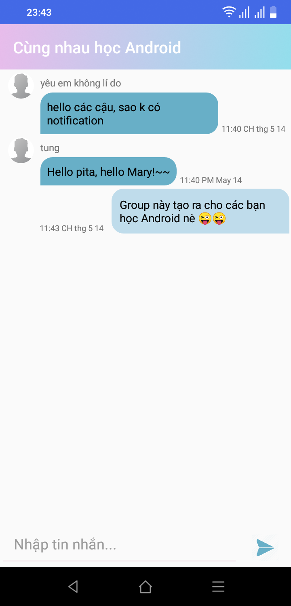
</p>

<p align="center">
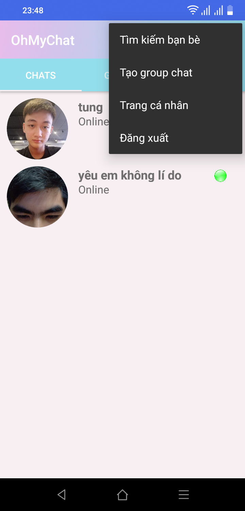
</p>

